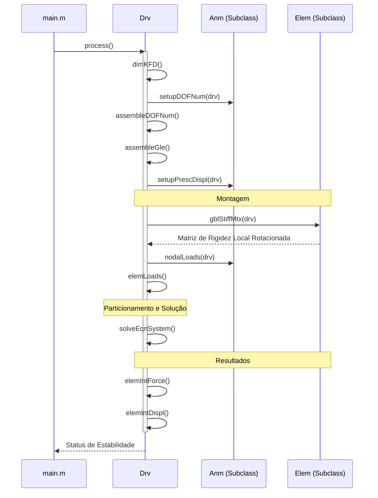

# Arquitetura e Fluxo de Operação - LESM

Este documento descreve a organização das classes e o fluxo de execução do programa **LESM (Linear Elements Structure Model)**.

## 1. Organização das Classes

O LESM utiliza o paradigma de Orientação a Objetos (OOP) para representar os componentes de uma estrutura.

### Classes Principais

- **`Drv` (Driver):** O controlador central. Representa o modelo estrutural como um todo e gerencia o processo de análise. Armazena as listas de nós, elementos, materiais e as matrizes globais ($K, F, D$).
- **`Anm` (Analysis Model):** Classe abstrata que define o comportamento do modelo (ex: Treliça 2D, Pórtico 3D, Grelha). Ela "projeta" o comportamento 3D genérico para as restrições de cada tipo de análise.
- **`Node` (Nó):** Representa os pontos de conexão, armazenando coordenadas, condições de contorno e carregamentos nodais.
- **`Elem` (Elemento):** Classe abstrata para os membros estruturais. Suas subclasses (`Elem_Navier`, `Elem_Timoshenko`) implementam diferentes teorias de flexão (Euler-Bernoulli ou Timoshenko).
- **`Lelem` (Load Element):** Gerencia os carregamentos aplicados diretamente aos elementos (cargas distribuídas e térmicas).
- **`Material` & `Section`:** Armazenam as propriedades físicas e geométricas, respectivamente.
- **`Print`:** Responsável por formatar e exibir os resultados da análise.

### Hierarquia de Especialização

- **Modelos de Análise (`Anm`):** `Anm_Truss2D`, `Anm_Truss3D`, `Anm_Frame2D`, `Anm_Frame3D`, `Anm_Grillage`.
- **Comportamento de Elementos (`Elem`):** `Elem_Navier`, `Elem_Timoshenko`.

---

## 2. Fluxo de Operação (Direct Stiffness Method)

O fluxo principal é orquestrado pelo método `Drv.process()`. Abaixo, as etapas na ordem de execução:

### I. Pré-processamento
1.  **`dimKFD()`:** Inicializa as matrizes globais de Rigidez ($K$), Força ($F$) e Deslocamento ($D$) com zeros.
2.  **`anm.setupDOFNum()`:** Identifica quais Graus de Liberdade (DOF) de cada nó estão livres ou restritos.
3.  **`assembleDOFNum()`:** Numera as equações globais, priorizando DOFs livres (numeração inicial) seguidos pelos restritos.
4.  **`assembleGle()`:** Monta o vetor de incidência (`gle`) de cada elemento, mapeando seus DOFs locais para os números das equações globais.
5.  **`anm.setupPrescDispl()`:** Adiciona deslocamentos prescritos (recalques) ao vetor $D$.

### II. Montagem do Sistema
6.  **`gblMtx()`:** Monta a Matriz de Rigidez Global ($K$) somando as contribuições de cada matriz de rigidez local de elemento rotacionada para o sistema global.
7.  **`anm.nodalLoads()`:** Adiciona forças nodais aplicadas diretamente ao vetor de forças global $F$.
8.  **`elemLoads()`:** Calcula as reações de engastamento perfeito (forças nodais equivalentes) para cargas distribuídas/térmicas e as adiciona ao vetor $F$.

### III. Solução
9.  **`solveEqnSystem()`:** Resolve o sistema $K \cdot D = F$ através de particionamento de matrizes, separando DOFs livres de restritos para calcular os deslocamentos desconhecidos e as reações de apoio.

### IV. Pós-processamento
10. **`elemIntForce()`:** Calcula os esforços internos (Momento Fletor, Esforço Cortante, Axial) nas extremidades de cada elemento.
11. **`elemIntDispl()`:** Calcula os deslocamentos internos ao longo do comprimento dos elementos para fins de visualização ou detalhamento.

---

## 3. Diagrama de Sequência Simplificado

